# CS211 Project ภาคต้น 2567

## ชื่อทีม kai-tod-hatyai-ni

### สมาชิกในทีม
| รหัสนิสิต | ชื่อ-นามสกุล (ชื่อเล่น)         | GitHub username |
| ---- |---------------------------------| --------------- |
|6610450242| นนทกานต์ อรุณวัฒนวงศ์ (นาย)  | Nontakan14 |
|6610450358| ภัทรการต์ เบ้งฮ้อ (แต้ม)    | httpmelt |
|6610450901| ชัยยงค์ คึมยะราช (เปา)   | paocked |
|6610451249| อริยชัย จอมเกาะ (ต้นน้ำ) | ariyachai |

## คลิปความก้าวหน้าของระบบ
| ครั้งที่                      |       กำหนดส่ง        | Youtube Link |
|-------------------------------|:---------------------:|--------------|
| ความก้าวหน้าของระบบครั้งที่ 1 | 9 ส.ค. 2567 17:00 น.  | https://youtu.be/zt7x6ioEXH8 |
| ความก้าวหน้าของระบบครั้งที่ 2 | 6 ก.ย. 2567 17:00 น.  | https://youtu.be/I-pvjpNgCGA |
| ความก้าวหน้าของระบบครั้งที่ 3 | 27 ก.ย. 2567 17:00 น. | https://youtu.be/CfRgK4z5RDc |
| โครงงานที่สมบูรณ์             | 18 ต.ค. 2567 17:00 น. |https://youtu.be/hg0JWpCpXlM |

## สรุปสิ่งที่พัฒนาในแต่ละครั้ง
### ความก้าวหน้าของระบบครั้งที่ 1
1. นนทกานต์ อรุณวัฒนวงศ์ (นาย)
   * มีหน้าต่างเมนูด้านซ้าย ใช้เข้าเมนูต่างๆ
   * มีปุ่มในการเข้าไปอนุมัติ
   * มีหน้า list view สำหรับคนที่เป็นผู้อนุมัติ
2. ภัทรการต์ เบ้งฮ้อ (แต้ม)
   * ทำหน้า Login
   * ทำ FXML ในส่วนของเจ้าหน้าที่คณะ ตอนนี้มีทั้งหมด 3 หน้า และทำปุ่มเชื่อมกันแล้วทุกหน้า
   * มีหน้าสำหรับดูรายการคำร้องทั้งหมด
   * มีหน้าจัดการคำร้องให้เพิ่มข้อมูลผู้อนุมัติ
   * มีหน้าสำหรับดูรายการคำร้องที่อนุมัติแล้ว
3. ชัยยงค์ คึมยะราช (เปา)
   * มีเมนูข้างซ้ายใช้คลิกเข้าไปในหน้าต่างๆ ได้แก่ หน้า Dash Board, หน้าข้อมูลผู้ใช้, ข้อมูลคณะและภาควิชา, รายชื่อเจ้าหน้าที่
   * ปุ่มเมนูมีรูปภาพบอกว่าแต่ล่ะปุ่มพาไปไหน และบอกว่าตอนนี้อยู่หน้าต่างอะไร จากการสังเกตุว่าปุ่มจะมีขอบสีเข้มรอบๆ
   * มีปุ่มสำหรับแก้ไขข้อมูลของเจ้าหน้าที่ และด้านซ้ายมีรายชื่อเจ้าหน้าที่
   * มีปุ่มและกรอบสำหรับใช้ในการค้นหารายชื่อของผู้ใช้ และรายชื่อผู้ใช้ทั้งหมด ในหน้าข้อมูลผู้ใช้
   * บนขวาของทุกหน้ามีรูปภาพ ชื่อ และ รหัสของผู้ดูแลระบบ
4. อริยชัย จอมเกาะ (ต้นน้ำ)
    * ทำ fxml ในส่วนของนิสิตและที่ปรึกษา
    * ในแต่ละหน้าที่ มีหน้าชัดเจนว่าหน้านั้นแสดงข้อมูลอะไรหรือต้องทำอะไร
    * ในแต่ละหน้าที่ มีปุ่มเชื่อมหน้ากันได้

### ความก้าวหน้าของระบบครั้งที่ 2
1. นนทกานต์ อรุณวัฒนวงศ์ (นาย)
    * มีการทำคอนโทรลเลอร์สำหรับจัดการ การแสดงข้อมูลคำร้องใน TableView จากไฟล์ CSV และจัดการการนำทางไปยังหน้าอื่น ๆ ในแอปพลิเคชัน
    * ได้มีการสร้างโมเดล เป็นโมเดลสำหรับเก็บข้อมูลของคำร้องแต่ละหัวข้อ มี Id, name , major ,type, date, time, status, และ approved โดยแต่ละฟิลด์จะเหมือนกับคอลัมน์ใน TableView
    * มีการสร้างโมเดล class ReqListจัดการรายการคำร้องทั้งหมด โดยมี ArrayList<Req> สำหรับเก็บรายการคำร้อง มีการเพิ่มรายการคำร้องใหม่ และการดึงรายการทั้งหมดออกมา
    * มีคลาส ReqListDatasource เพื่อที่จะอ่านและเขียนข้อมูลจากไฟล์ CSV

2. ภัทรการต์ เบ้งฮ้อ (แต้ม)
    * มีการเปลี่ยนแปลงโดยเปลี่ยนจาก ListView ในการหน้าจัดการคำร้องให้เป็น TableView และได้สร้างโมเดลพื้นฐานที่สำหรับอ่านไฟล์ csv เรียบร้อยแล้ว แก้ไข FXML ของการใส่รายละเอียดของผู้จัดการคำร้อง โดยได้ลองทดสอบกับไฟล์ csv แล้วเรียบร้อย
    * เพิ่มเติมในส่วนของ User / UserList model ให้มีระบบ login โดยใช้ User สำหรับจัดการตรวจสอบ Username และ Password ด้วย BCrypt ส่วน UserList ทำการจัดการผู้ใช้และฟังก์ชันสำหรับ LoginController ให้ตรวจสอบ Username และ Password แล้วเปลี่ยนหน้าไป FXML ตามที่ผู้ใช้ login 
3. ชัยยงค์ คึมยะราช (เปา)
    * เพิ่ม models Data Data List (อาจแก้ไขไปใช้ User UserList)
    * ทำให้ ListView ใช้ได้แล้ว ใน personal-view.fxml และ data-view.fxml
    * แก้ไข addUSer method ใน class  UserList ให้ มี 2 method ข้อมูลรับ มาจำนวนต่างกัน ให้สามารถใช้กับ login controller ได้ และ personalController ได้
    * สร้าง Constructor เพิ่ม ให้ loginController เพื่อให้ loginController ส่งค่าไปเก็บใน User ได้
    * เพิ่ม ตัวแปร ที่รับเข้า มา ใน Contructor ของ Class User เพิ่ม
    * สร้าง model User และ UserList
4. อริยชัย จอมเกาะ (ต้นน้ำ)
    * ในส่วนของนิสิต 
    * มีการลบหน้าfxmlในส่วนของหน้าแบบฟอร์มที่ต้องกดเลือกประเภทฟอร์มในหน้านั้นออกไป ละเป็นทำเป็นปุ่มแถบด้านข้างให้เลือกหน้าไปประเภทฟอร์มนั้นๆได้แทน (ตอนนี้จะมีหน้าฟอร์มขอผ่อนผันค่าเทอมเป็นแบบตัวอย่าง ในอนาคตก็จะมีหน้าประเภทฟอร์มเยอะมากขึ้น)
    * ในส่วนของหน้าติดตามคำร้อง สามารถแสดงรายชื่อบนTableViewได้ โดยใช้วิธีดึงข้อมูลจากcsvมา
    * ในส่วนของอาจารย์ที่ปรึกษา ทั้งหน้าจัดการคำร้อง, หน้าแสดงรายชื่อนิสิต, หน้าประวัติคำร้องนิสิต มีการนำข้อมูลขึ้นtable viewได้ โดยใช้ csv เดียวกันกับของนิสิต (ข้อมูลที่ขึ้นบนtableviewจะมีการแก้ไขอีกทีเพราะข้อมูลยังไม่ถูกต้อง100%)
    * มีการสร้างmodelนิสิต, อาจารย์ที่ปรึกษา และ modelของฟอร์มเบื้องต้น


### ความก้าวหน้าของระบบครั้งที่ 3
1. นนทกานต์ อรุณวัฒนวงศ์ (นาย)
    * ได้มีการแก้ข้อหน้าจัดการการอนุมัติว่าจะส่งต่อให้ใคร โดยการเลือกหัวข้อที่ ComboBox เมื่อเลือกแต่ละหัวข้อสถานะจะถูกอัพเดทไปตามข้อนั้นๆแล้ว ก็จะพาไปหน้าที่สามารถเลือกได้ว่าดำเนินการโดยใครโดยสามารถเลือกได้ผ่าน ComboBox โดยข้อมูลของ ComboBox ถูกเอามาจากหน้าการกำหนดชื่อบุคคลที่จะอนุมัติคำร้องและได้เพิ่มปุ่ม แนบไฟล์ และเมื่อกดไปวันและเวลาที่อนุมัติ ก็จะถูกอัพเดท
    * มีหน้าที่จะโชว์ข้อมูลของนักเรียนผ่าน listview และถ้ากดเข้าไปแต่ละหัวข้อเราก็สามารถกดปุ่ม edit เพื่อที่จะแก้ไขข้อมูลได้เมื่อกดปุ่ม edit ก็จะพาไปหน้าที่มันสามารถเขียนข้อมูลใหม่ใส่ลงไปได้
    * มีการสร้าง csv person_data.csv เพื่อเก็บข้อมูลคนที่จะอนุมัติ Reason-for-refusing.csv เพื่อบันทึกเหตุผลที่จะปฎิเสธ Req-list.csv เพื่อโชว์ข้อมูลคนที่ส่งคำร้องมา Student-info.csv เก็บข้อมูลของนิสิต who-accept.csv บันทึกว่าใครเป็นผู้กดอนุมัติและได้เพิ่ม DepartmentReqListDatasource
2. ภัทรการต์ เบ้งฮ้อ (แต้ม)
    * มีการเพิ่มในส่วนของการเพิ่มผู้อนุมัติและบันทึกลงไฟล์ csv ได้ จากนั้นไปให้ไปแสดงใน ComboBox ของหน้าจัดการคำร้อง
    * มีการแก้ไขหน้าจัดการคำร้องโดยทำเป็น TableView เมื่อกดเข้าไปจะแสดงรายละเอียดและมี CheckBox ให้เลือกว่าจะ อนุมัติคำร้อง หรือ ปฏิเสธคำร้อง
    หากเลือก อนุมัติคำร้อง ก็มี ComboBox ของผู้ที่จะอนุมัติ และปุ่มสำหรับแนบไฟล์ หากเลือก ปฎิเสธคำร้อง ก็จะมี TextArea มาให้ใส่เหตุผลที่ปฏิเสธ เมื่อกดปุ่ม  ดำเนินการ ก็จะไปบันทึกใน csv แล้วนำไปแสดงใน TableView ที่หน้ารายการคำร้องที่อนุมัติ
    * มีหน้า homepage เพื่อให้ผู้ใช้ สำหรับ KU Ofiicer Login(สำหรับอาจารย์ เจ้าหน้าที่และผู้ดูแลระบบ) และ KU Student Login(สำหรับนิสิต) และทำการเชื่อมหน้าไปที่หน้า login 
3. ชัยยงค์ คึมยะราช (เปา)
    * เปลี่ยนจาการใช้ ListView ไปเป็นการใช้ TableView บน data-view.fxml กับ personal-view.fxml
    * เพิ่มข้อมูลเข้าไปใน TableView ของหน้า section-view.fxml
    * section-view.fxml สามารถมีหน้าต่าง PopUp โดยสามารถใส่ข้อมูลชื่อคณะ รหัสคณะ และ คลิกปุ่ม OK เพื่อแก้ไขข้อมูลได้ บน csv ได้
    * มีการเชื่อมให้ TableView สามารถเชื่อมกับ สามารถ WriteData หรือ ReadData บน csv ได้
    * sectionTwo-view ยังไม่มีการเปลี่ยนแปลงอะไร
    * personal-view.fxml สามารถมีหน้าต่าง PopUp ขึ้นมาเพื่อให้สามารถแก้ไขข้อมูลบน TableView และ csv ได้ โดยกดปุ่ม OK หลังจากแก้ไขบน TextField
4. อริยชัย จอมเกาะ (ต้นน้ำ)
    *ในส่วนของนิสิตมีการสร้างหน้าล็อคอินกับลงทะเบียนเป็นของตัวเอง(แยกกับเจ้าหน้าที่) โดยระบบล้อคอินของนิสิตสามารถ detectรหัสผ่านได้ แต่ยังไม่ได้ใช้แบบhashcode(ต้องไปแก้ไข)
    * ในส่วนของนิสิตเมื่อloginเข้ารหัสของตัวเองแล้ว จะไปหน้ารายการคำร้องทั้งหมดที่เคยส่ง โดยสามารถกดดูรายละเอียดได้ ซึ่งในหน้ารายละเอียดจะมีส่วนที่บอกstatusคำร้องว่าดำเนินการไปถึงไหนแล้ว และ ในรายละเอียดคำร้องจะไม่สามารถแก้ไขรายละเอียดได้
    * ในส่วนของนิสิตในรายการเพิ่มคำร้อง สามารถเพิ่มคำร้องได้
    * ในส่วนของอาจารย์ที่ปรึกษาสามารถโชว์รายการคำร้องที่ต้องอนุมัติของนิสิตที่อยู่ในการดูแลของตนได้ เมื่อกดรายละเอียดเข้าไปจะสามารถกดอนุมัติหรือปฏิเสธได้ เมื่อกดอย่างใดอย่างหนึ่งแล้ว ในหน้าแสดงรายการคำร้องที่ต้องอนุมัติ(ฟอร์มที่อนุมัติแล้วจะหายไป)
    * ในส่วนรายละเอียดคำร้องของนิสิต จะมีการอัพเดทสถานะคำร้องเมื่ออาจารย์ที่ปรึกษาอนุมัติแล้ว

### โครงงานที่สมบูรณ์
1. นนทกานต์ อรุณวัฒนวงศ์ (นาย)
    * ได้เพิ่มให้สามารถกรองข้อมูลจากข้อมูลกลางที่ส่งมาได้
    * เปลี่ยนจากการกดadd และ edit นิสิตแล้วไปหน้าตามที่เรากดเปลี่ยนเป็น popup 
    * แก้หน้าจัดการข้อมูล ให้ข้อมูลจะขึ้นตามรายการที่ส่งขึ้นมาที่tableแล้วมีปุ่มกดจัดการข้อมูล แล้วจะมีหน้าpopupเด้งขึ้นมาและมันจะขึ้นcheckbox ให้เลือกว่าจะดำเนินการยังไงกับข้อมูลมีดำเนินการเอง กับ ส่งต่อให้คณะบดีและปฎิเสธ เมื่อกดหัวข้อดำเนินการเอง กับ ส่งต่อให้คณะบดีจะมี comboboxขึ้นมาและข้อมูลใน comboboxเอาข้อมูลมาจากคนที่จะอนุมัติที่เราได้เพิ่มไปและสามารถกดแนบไฟล์ที่เราอนุมัติได้เมื่อกดจะปฎิเสธจะมี textfield ให้เขียนเหตุผลที่จะปฎิเสธเลือกและสามารถกดแนบไฟล์ได้
    * เพิ่มข้อมูลที่ขึ้นหน้า table ให้แสดงมากขึ้น และเพิ่มหน้า logout และ option
    * เปลี่ยนให้สามารถกดหัวข้อบน table ลบคนที่จะอนุมัติที่เราเพิ่มให้ไปใน listview ได้
    * เปลี่ยนให้สามารถกดหัวข้อบน table ลบคนที่จะอนุมัติที่เราเพิ่มให้ไปใน ListView ได้
2. ภัทรการต์ เบ้งฮ้อ (แต้ม)
    * ทำหน้า staff login และให้สามารถเปลี่ยนรูปได้และเปลี่ยนรหัสได้และทำให้บันทึกเวลาได้ไว้เพื่อผู้ดูแลระบบนำไปแสดงบน TableView
    * ทำในส่วนเจ้าหน้าที่คณะแสดงคำร้องทั้งหมดในคณะ โดยเรียงจากวันที่ดำเนินการล่าสุด
    * ทำในส่วนเจ้าหน้าที่คณะเพิ่ม/แก้ไขผู้ที่จะอนุมัติ
    * ทำให้เจ้าหน้าที่จัดการคำร้องได้โดยคัดกรองจากคำร้องที่ได้รับการอนุมัติจากเจ้าหน้าที่ภาควิชา
    * ทำ pop-up ให้มี checkbox อนุมัติ มี combo box ให้เลือกผู้ที่จะอนุมัติ และมีปุ่มให้แนบไฟล์และมีการบันทึกไฟล์ลงในโปรเจค และมี checkbox ปฏิเสธคำร้องและต้องใส่เหตุผลถึงจะดำเนินการ
    * ทำ UML Diagram 
    * มีการร่วมกันวางโครง csv ต่าง ๆ ร่วมกันกับต้นน้ำ
    * เตรียมข้อมูลรายการคำร้อง
    * เตรียมข้อมูลเจ้าหน้าที่คณะและเจ้าหน้าที่วิชา
    * ทำหน้าคำแนะนำในการใช้งานโปรแกรม
    * ช่วยเหลือทุกบทบาท
3. ชัยยงค์ คึมยะราช (เปา)
    * เพิ่มปุ่ม 2 ปุ่ม เมื่อกดให้สามารถโชว์หน้าต่าง Popup ให้สามารถแก้ไขข้อมูล หรือ แก้ไข บนข้อมูลคณะได้
    * เพิ่มปุ่ม 2 ปุ่ม เมื่อกดให้สามารถโชว์หน้าต่าง Popup ให้สามารถแก้ไขข้อมูล หรือ แก้ไข บนข้อมูลภาควิชาได้
    * รายชื่อบุคลากรมีการเพิ่ม Column Role ขึ้นมา
    * ได้มีการสร้างวิธีโชว์ข้อมูลบน หน้ารายชื่อผู้ใช้ระบบ
    * มีการเพิ่มเวลา บนข้อมูลผู้ใช้ระบบให้สามารถโชว์เวลาที่ ผู้ใช้ระบบ login ได้ โดย เรียงจาก ก่อนไปหลัง
4. อริยชัย จอมเกาะ (ต้นน้ำ)
    * ในส่วนของนิสิต
    * มีระบบลงทะเบียนนิสิต สำหรับนิสิตที่กรณียังไม่เคยตั้ง username password นิสิตจะต้องมาลงทะเบียนตั้ง username กับ password ก่อนจึงจะloginเข้าระบบได้ (กรณีที่ชื่อนิสิต, นามสกุล, รหัสนิสิต, อีเมล ไม่ถูกต้องหรือไม่มีในระบบ จะไม่สามารถลงทะเบียนได้)
    * หน้าประวัติคำร้อง แสดงรายการประวัติคำร้องนั้นๆ โดยมีการเรียงลำดับตามเวลาแก้ไขสถานะล่าสุดขึ้นก่อน และมีปุ่มค้นหารายการคำร้อง(หาจากประเภทคำร้อง, สถานะคำร้อง หรือ ขั้นตอนการดำเนินการ)
    * สามารถไปหน้าตั้งค่าเพื่อเปลี่ยนรหัสผ่านหรือรูปได้
    * ส่วนของการเพิ่มคำร้อง กรณีที่นิสิตยังไม่มีอาจารย์ที่ปรึกษา จะไม่สามารถไปยังหน้าเพิ่มคำร้องเพื่อเพิ่มคำร้องได้
    * ในส่วนของอาจารย์ที่ปรึกษา
    * ในหน้ารายชื่อนิสิตในที่ปรึกษา(สามารถค้นหานิสิต ด้วยรหัสนิสิต, ชื่อ หรือ นามสกุลบางส่วนได้)
    * สามารถไปหน้าการตั้งค่าได้เพื่อเปลี่ยนรหัสผ่านและรูปโปรไฟล์ใหม่ได้
    * สามารถคลิกดูประวัติคำร้องของนิสิตคนนั้นได้ โดยมี ชื่อ นามสกุล รหัสนิสิตแสดงบอกด้านบน
    * สามารถคลิกดูรายละเอียดคำร้องนั้นได้
    * หน้าจัดการคำร้องนิสิต สามารถอนุมัติหรือปฏิเสธคำร้องได้ (กรณีปฏิเสธคำร้อง จะต้องใส่เหตุผลการปฏิเสธ จึงจะสามารถปฏิเสธได้)
    * เมื่อจัดการคำร้องแล้ว ข้อมูลที่ถูกอนุมัติ/ปฏิเสธแล้ว จะหายไปจากตารางรายการคำร้องที่ต้องอนุมัติ
    * มีการร่วมกันวางโครง csv ต่าง ๆ ร่วมกันกับแต้ม 
    * สามารถทำให้นิสิตสามารถเปลี่ยนรูปโปรไฟล์และรหัสผ่านได้
    * เตรียมข้อมูลนิสิตและอาจารย์ที่ปรึกษา
    * ทำหน้าผู้จัดทำ
    * ช่วยเหลือทุกบทบาท

## วิธีการติดตั้งและรันโปรแกรม
อธิบายวิธีการติดตั้ง และวิธีการรันโปรแกรม รวมถึงที่อยู่ของไฟล์ pdf 
* คำสั่งรันจากใน directory release : ```java -jar Student-Request-Application.jar```
* หรือสามารถดาวน์โหลด Student-Request-Application.jar, data.zip(ข้อมูลเพื่อทดลองการใช้งาน) และคู่มือการใช้งานแอปพลิเคชัน ได้ที่ https://drive.google.com/drive/folders/1tzpUupg2VIa-dm2H9ayrnxJ2V5zzevvm?usp=sharing


## ตัวอย่างข้อมูลผู้ใช้ระบบ (username, password)

ผู้ดูแลระบบ : admin, 6610450901

เจ้าหน้าที่คณะ : supasuta, password

เจ้าหน้าที่ภาควิชา : thanawat, password

อาจารย์ที่ปรึกษา : apichai.j, password

นิสิต : ariyachai.j, password

## การวางโครงสร้างไฟล์ของโครงงาน
#### Controllers Class UML Diagram
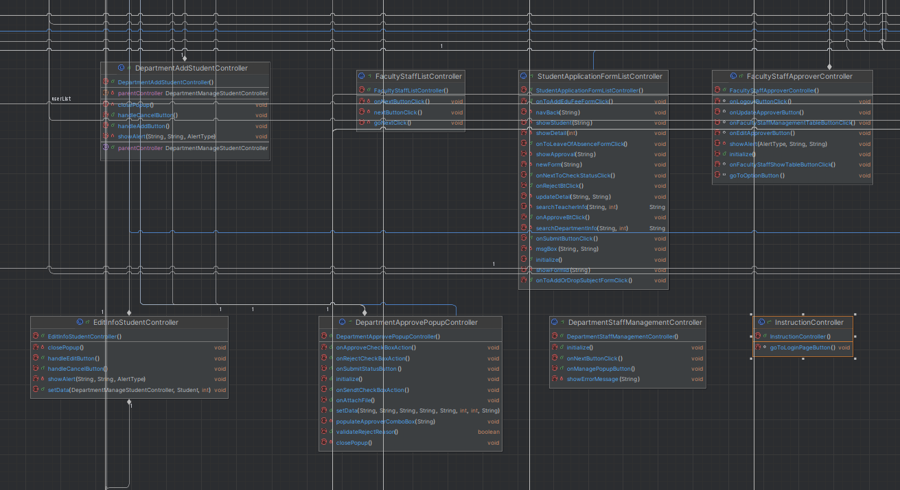
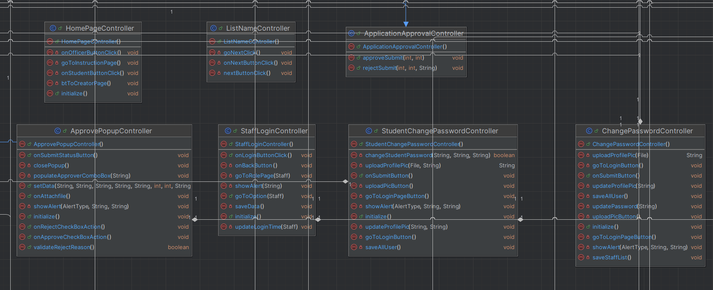
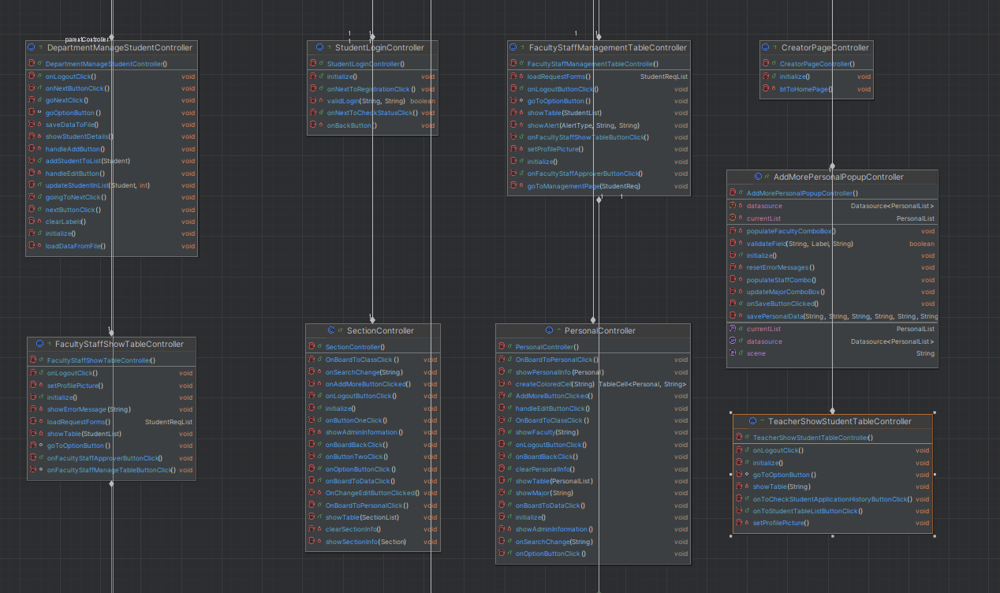
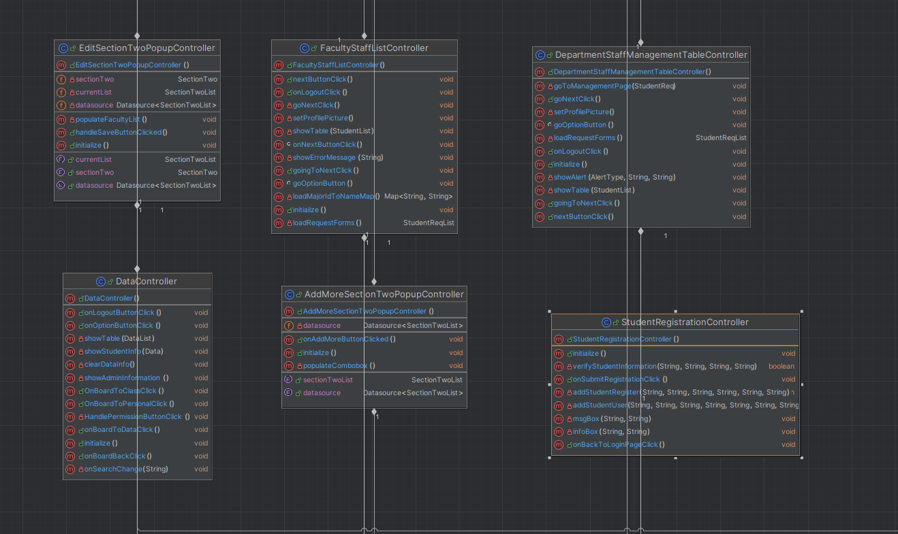
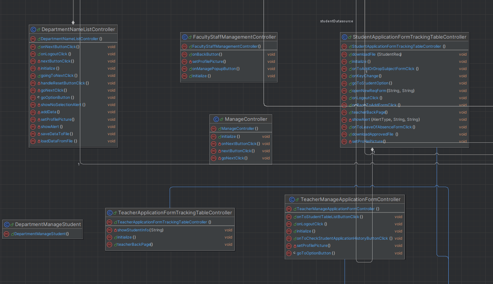
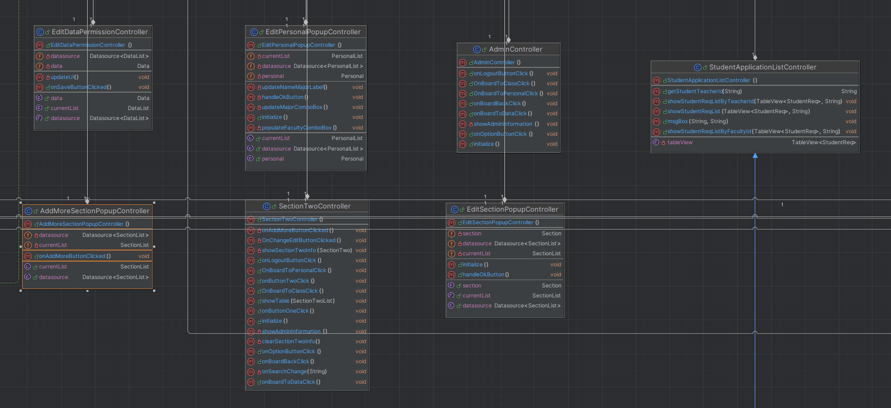
#### Models Class UML Diagram
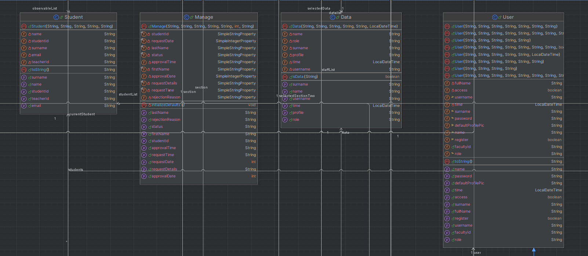
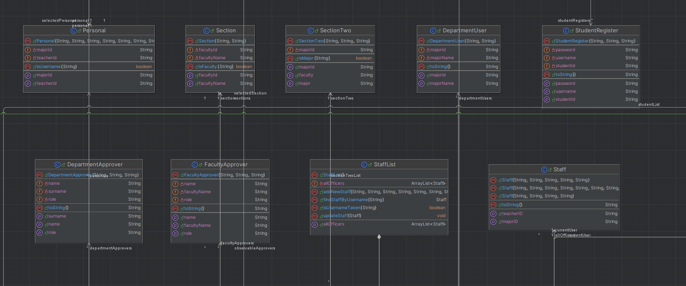
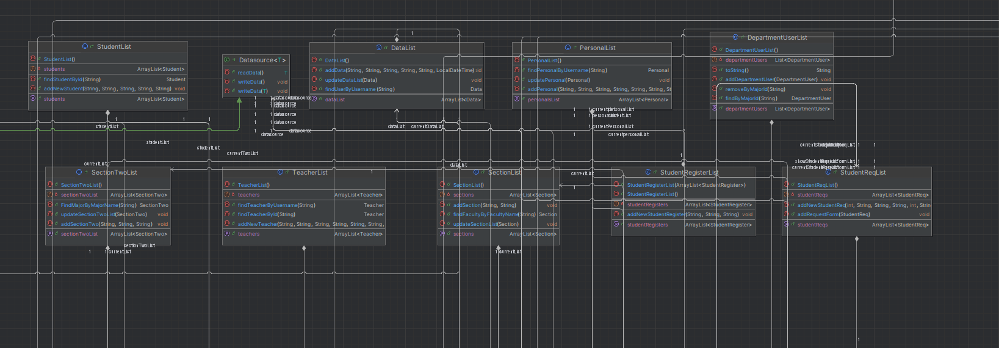
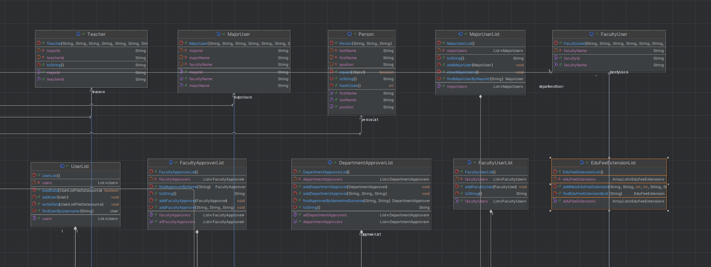
#### Services Class UML Diagram
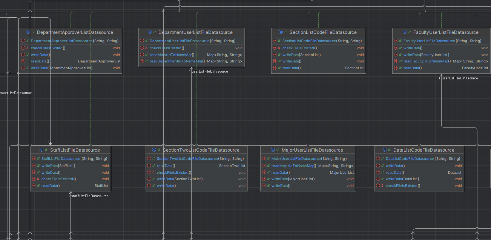
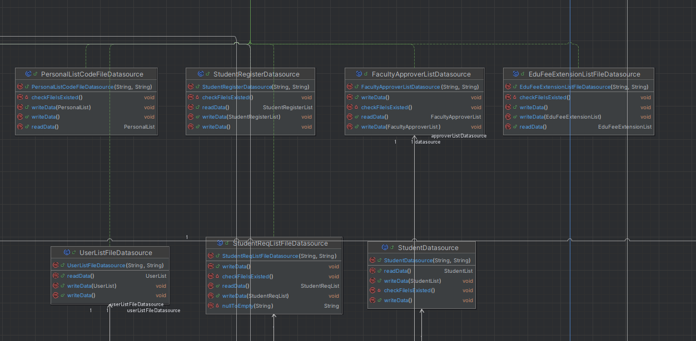